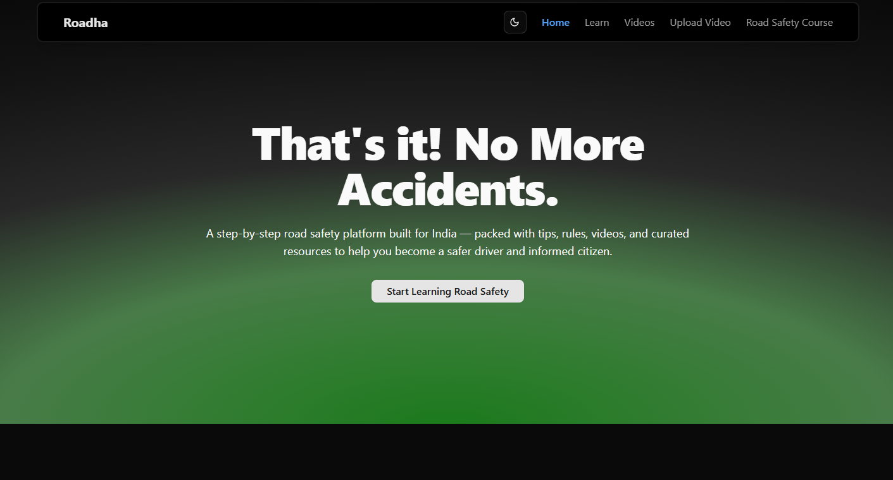

# Roadha



**Roadha** is a first-in-class Indian road safety platform that aims to educate users, promote safe driving behavior, and create awareness through structured learning and community participation.

## 🚀 Current Features

- ✅ **Road Safety Course**
  - Beginner-friendly, step-by-step lessons

## 🧑‍💻 Tech Stack

- **Next.js** (App Router)
- **React**
- **TypeScript**
- **shadcn/ui**
- **Tailwind CSS**
- [**Fumadocs**](https://fumadocs.dev/)
- [**react-tweet**](https://react-tweet.vercel.app/)
- **Radix UI**
- **React Icons**

## 📁 Getting Started

```bash
# Clone the repo
git clone https://github.com/Sumansourabh14/roadha.git

# Navigate into the project
cd roadha

# Install dependencies
npm install

# Run the development server
npm run dev
```

## 🌐 Live Demo

Coming soon...

## 📌 Upcoming Features

- [ ] Weekly video lessons with voiceovers
- [ ] "Safest Cars in India" curated list
- [ ] Upload and report road incidents (dashcam/CCTV)
- [ ] Trivia and quizzes
- [ ] Email newsletter and alerts

## 📫 Connect

- Twitter/X: [@roadha\_](https://x.com/roadha_)
- GitHub: [Sumansourabh14/roadha](https://github.com/Sumansourabh14/roadha)

> Come on now! Time to make Indian roads safer.
