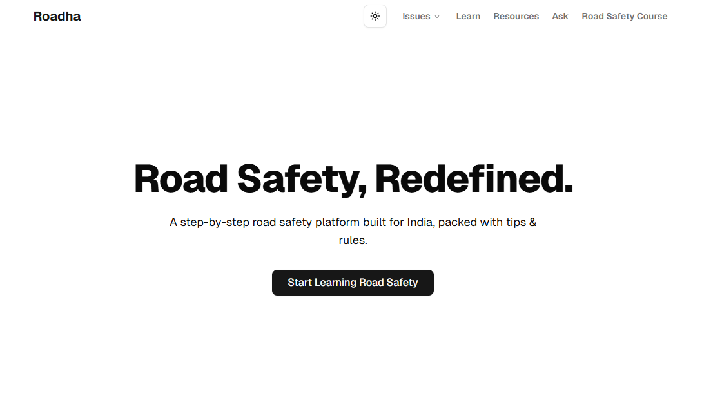

# Roadha



## Learn Road Safety in India

**Roadha** is a first-in-class Indian road safety platform that aims to educate users, promote safe driving behavior, and create awareness through structured learning and community participation.

## Motivation

In India, there are two aspects about road safety.

1. The government
2. The people

**Bad roads?** Government is responsible

**Bad road sense?** People are responsible

Well, I will leave the "bad roads" thing to the government (for now)

2026 is around the corner and yet, is there really no platform that can help us understand about road safety in an easy manner?

Do you know...

- How to behave on roads?
- How to drive responsibly on highways and in traffic?
- When to give way to someone?
- When to be a defensive driver?
- How to change lane safely?

Ignore all that.
Why should we not overtake on a curve?

Hmm, ignore that too.
What does a continuous white line in the center of the road means?

Still, ignore all that.
**90%** of passengers don't even wear rear seatbelts.

Ignore everything.
Some of the cabs don't even have proper functioning seatbelts for the front passenger.

We Indians do this best: "Ignore". **But why??**

So let me try to do something here on this "Road safety" topic in India.

There’s no easy, fun, and India-specific way to learn road safety.

- We don’t teach it in schools.
- We don’t re-learn it before buying a new car.
- We don’t quiz ourselves before hitting the highway.

Even if 1 person, just 1 PERSON can learn something new from Roadha, I will be good.

**Learn Road Safety:** [www.roadha.space](www.roadha.space)

## Current Features

- **FREE Beginner Road Safety Course**
  - Beginner-friendly, step-by-step lessons
  - Total: 50 lessons, 12 lessons added
  - Real life examples
    - From Twitter, YouTube, and other resources
  - Laws and regulations
  - Genuine sources
  - Fines
  - Helpful resources

## 🧑‍💻 Tech Stack

- **Next.js** (App Router)
- **React**
- **TypeScript**
- **shadcn/ui**
- **Tailwind CSS**
- [**Fumadocs**](https://fumadocs.dev/)
- [**react-tweet**](https://react-tweet.vercel.app/)
- **Radix UI**
- **React Icons**

## 📁 Getting Started

```bash
# Clone the repo
git clone https://github.com/Sumansourabh14/roadha.git

# Navigate into the project
cd roadha

# Install dependencies
npm install

# Run the development server
npm run dev
```

## 📫 Connect

- Instagram: [@roadha.india](https://instagram.com/roadha.india)
- Twitter/X: [@roadha\_](https://x.com/roadha_)
- GitHub: [Sumansourabh14/roadha](https://github.com/Sumansourabh14/roadha)

> Not just a platform. A public movement.
